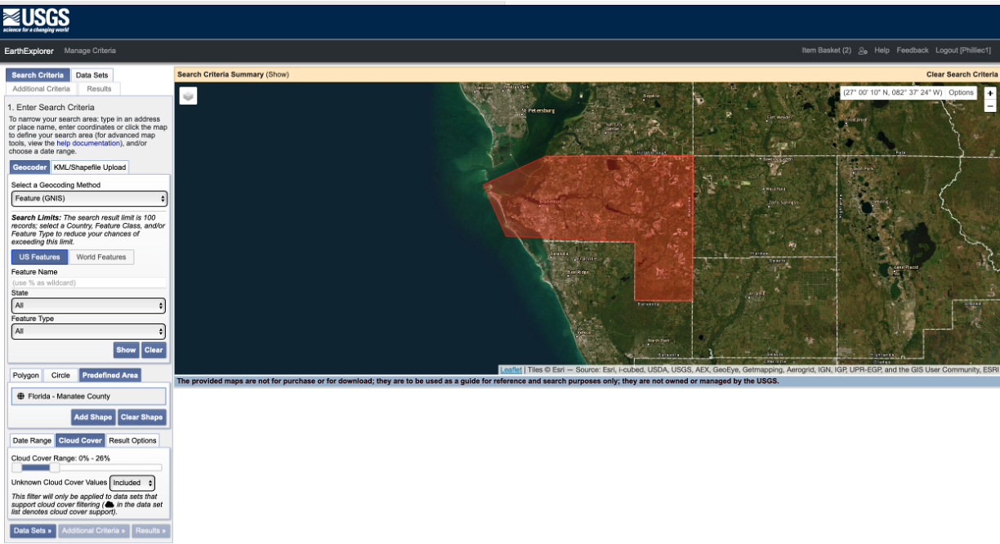
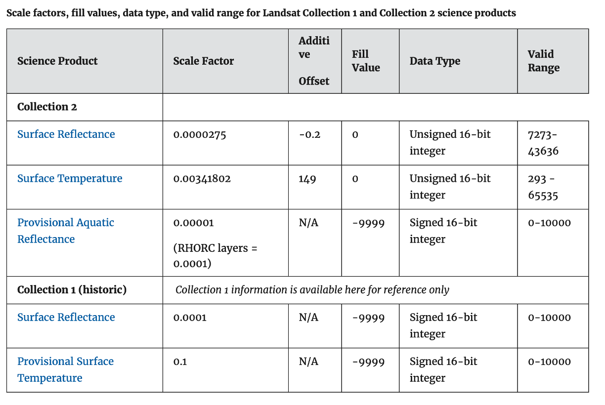
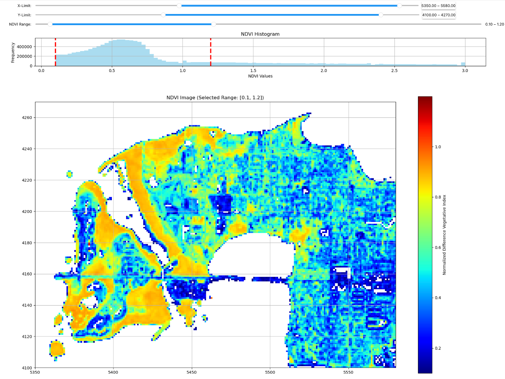
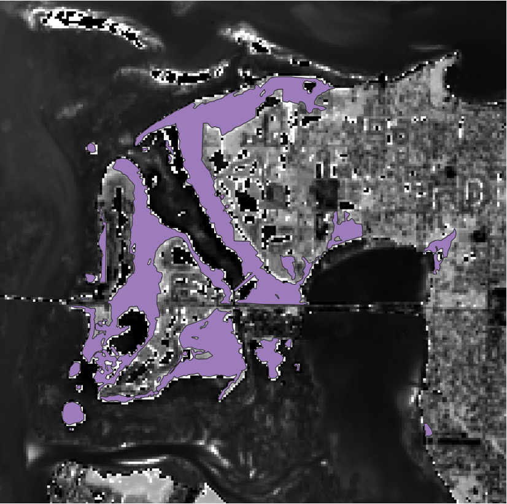
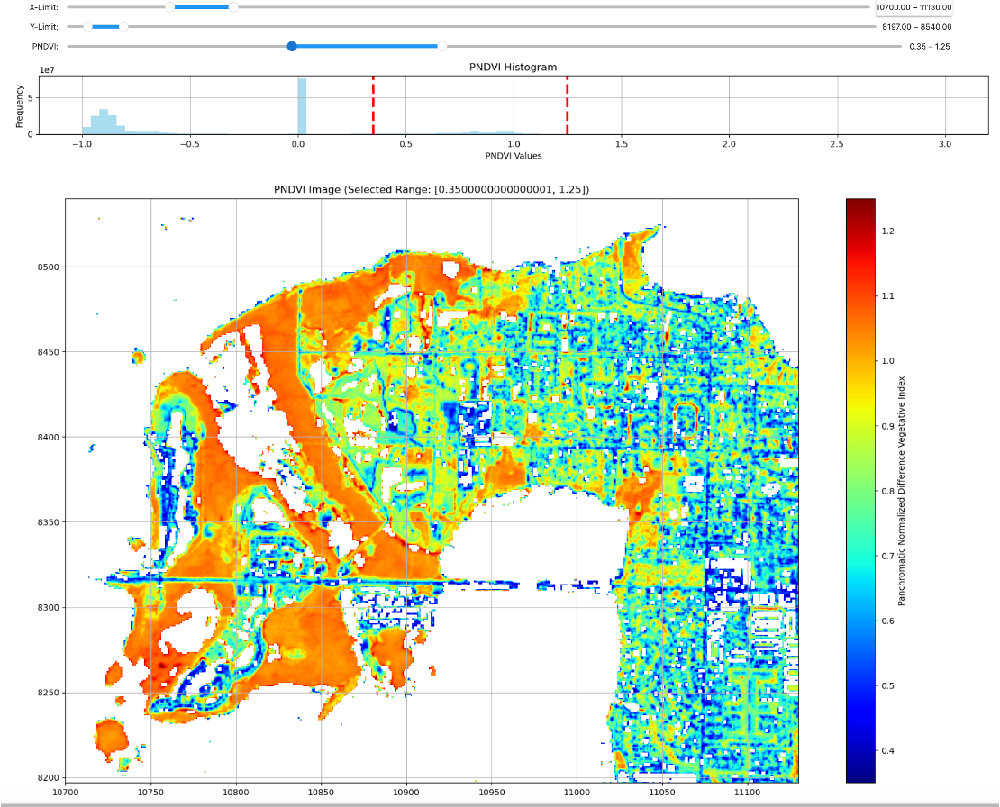
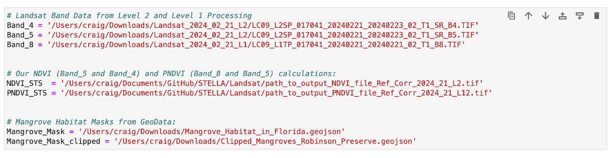
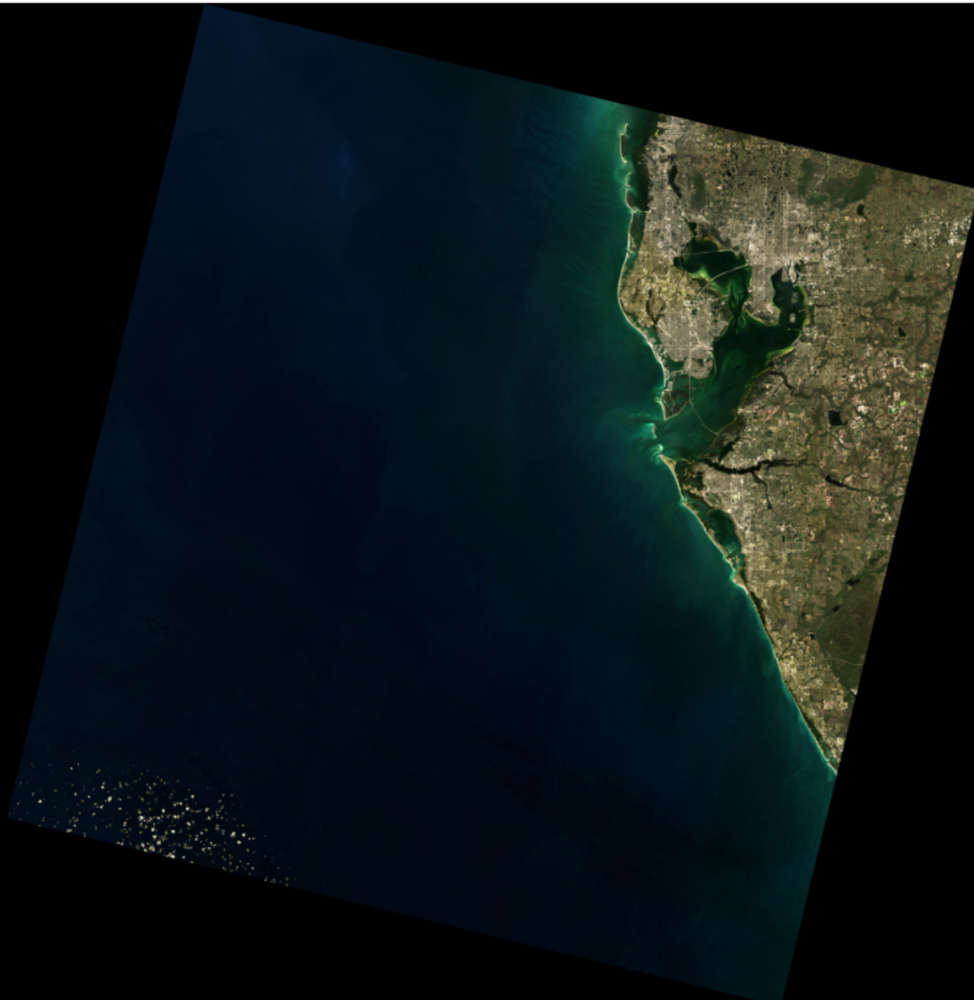
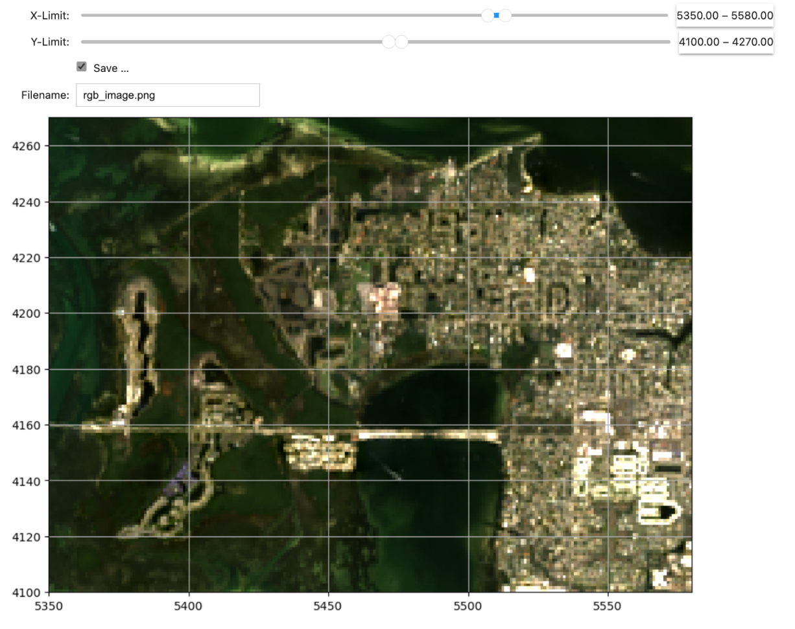

# Science-and-Technology-Society-Use-of-NASA-Landsat-Data-to-Calculate-NDVI-and-PNDVI
The Science and Technology Society of Sarasota-Manatee Counties use Landsat 9 data to calculate Normalized Difference Vegetative Index (NDVI) from Landsat NIR Band 5 and Red Band 4 as well as our testing of the Panchromatic Normalized Difference Vegetative Index (PNDVI) from Panchromatic Band 8 and NIR Band 4 for a high resolution (15m) NDVI to assess the health of Mangrove Forests in Sarasota Bay, Florida. 

The python code in this repository expects you to have downloaded your Landsat Level 2 processed Bands 4 (red), 5 (NIR) and Level 1 processing Band 8 (Panchromatic) spectral bands. 

# [STS](https://scienceandtechnologysociety.org/) Approach to Map Vegetative Habitats for a Proposed Study Areas in Robinson Preserve, Manatee County, Fl.

## Introduction:

In a report supplied by Sherri Swanson of Manatee County called the Mangrove Heart Attack, the authors employ some interesting methods to identify Mangrove Forests from Landsat Spectral data. They calculated the Normalized Difference Vegetative Index (NDVI) from their Landsat-type data and then used simple NDVI cutoffs to differentiate and map their Mangrove Habitats and assess the health of these Mangroves too. 

We were inspired by this report, so we tried some of the techniques mentioned in this report using python to process the data. We first went to [Earth Explorer](https://earthexplorer.usgs.gov/) to download our Level 1 and Level 2 Landsat data with all the spectral channels.  

You will need to setup an account in order to download any data. There is no charge for the account or for the downloading of the data.

We applied a Reflectance Correction per the advice from Mike Taylor of NASA, and this made a huge difference with all the Landsat Band data corrected to Reflectance, epsecially from the Level 2 processed Landsat data used in Calculating NDVI. The following  equation was use to correct the raw Landsat Band data to Reflectance Band data:

    corrected_array = image_array * 0.0000275 - 0.2

Landsat data is stored as integers probably due to minimize the size and transfer time of these data from the satellite back to earth.  Mike's recommended correction then converts this integer data into [Reflectance](https://www.usgs.gov/faqs/how-do-i-use-a-scale-factor-landsat-level-2-science-products). 

https://www.usgs.gov/faqs/how-do-i-use-a-scale-factor-landsat-level-2-science-products

Per the USGS Landsat data is stored as integer values ranging from 7,273 to 43,636 per USGS document above. This is a difference of 36,363 integer values within this range, or a value of 0.0000275 for each integer value. 

    1/36,363 =  0.0000275
    
Since  0.0000275 is the *Reflectance per Integer*, then 

    Apparent Reflectance of Integer of 7,237 *  0.0000275 = 0.2
    
and

    Apparent Reflectance of Integer of 43,626  *  0.0000275 = 1.2
    
To convert our *Apparent Reflectance* to *Reflectance* as an index, we subtract 0.2 from the *Apparent Reflectance* and now *Reflectance* is scaled between 0 and 1.

From the Reflectance corrected Band data we can then calculate NDVI using the following equation:

    NDVI = (near IR - Red)/(near IR + Red) = (Band 5 - Band 4)/(Band 5 + Band 4)

NDVI appears to be a great indicator that provides useful information in making vegetative identifications as suggested by the name. We were able calculated NDVI for the Robinson Preserve area including West Bradenton.  In some of the plots below, most of the warmer colors are actual mangrove habitat estimates. 

In the Mangrove Heart Attack report, they applied simple cutoffs to the NDVI index data to identify their Mangrove habitats, and in this report they went as far as to identify species of Mangroves too. For now, we are satisfied with being able to identify Mangroves in general.  

NDVI calculates an index ranging from our Landsat spectral data from -3 to 3. For our estimate we initially colored our NDVI image from 0. to 1, where these cutoff values create the surface areas that correlates fairly well to the mapped mangrove locations as reported by [GeoData](https://geodata.myfwc.com/datasets/a78a27e02f9d4a71a3c3357aefc35baf/about). We probably have an 80% solution using this simple technique; and other than some lawns in Bradenton, we are doing pretty well. 

This is a start, but with a few rules applied (mangrove habitats must be adjacent to salt water, near sea-level elevations  ….) we can narrow down our mangrove habitat picks even more. In addition, we can reduce a lot of the false positives by requiring a certain number of pixels required in each habitat cluster. 

## These are the GeoData mapped Mangrove Habitats for our Study Area:

Using our cutoff estimations from 0.1 to 1.2, our Mangrove Habitats correlate fairly well to the mapped Mangrove Habitats as reported by [GeoData](https://geodata.myfwc.com/datasets/a78a27e02f9d4a71a3c3357aefc35baf/about) as shown in the bottom image below. 

We have also calculate *Panchromatic Normalized Difference Vegetation Index (PNDVI)* from spectral Landsat data:

    PNDVI =  (near IR - Panchromatic)/(near IR + Panchromatic) = (Band 5 - Band 8)/(Band 5 + Band 8) 

where Band 5 is the Near IR band and Band 8 is the Panchromatic band with increased 15m spatial resolution vs. 30m. For PNDVI we must first resolution match the Near IR Band 5 at 30m resolution to the Band 8 at 15m resolution for a PNDVI that has higher resolution than NDVI. NDVI is the more traditional approach, but we are testing PNDVI to see if this might provide a similar product to NDVI, but with increased resolution. 

We typically download the Level 2 processed Bands 4 and 5, but Band 8 only comes with the Level 1 processing data. At this point we are using Level 2 Bands 4 and 5 in combination with Band 8 Level 1 data in our processing. 

**We always create histograms of NDVI and PNDVI to ensure that they have a range between -3.0 to around 3.0 to screen out any noise and .**

The key to our STS study will be our on-site station studies that will allow us to confirm actual mangrove habitats from other species, rule out any false positives and obtain hard spectral data by species. We might even refine the GeoData picks. It appears that they might be using a similar method to identify mangrove habitats as to what we are doing, but we will be on-site to verify our picks in the end. 

Will any of this be publishable? There is probably much more to the study that we will better understand as the project proceeds, but just maybe we will have something worth writing about in at least a **Medium** article: Citizen Science Group Sponsored by [STS](https://scienceandtechnologysociety.org/) Helps in the Maintaining and Restoration of our Local Wetlands in Bradenton County, FL.

This process is rather automatic in that the user only needs to define the path to the Level 2 processed Bands 4 & 5 and Level 1 processed Band 8. We need to also create a full path for our NDVI and PNDVI products data to be saved. Finally, we need a link to the geojson Mangrove Habitat file from GeoData as well as a path to our clipped Mangrove Habitat file that we create that is just over our study area/ 

---
---
# **User Input of Full Path Names Required in the Next Cell:**
## Define Band 4, 5 and 8 data from Level 2, Level 2 and Level 1 path names, respectively:
## And then our NDVI (Band_4 Red and Band_5 NIR) and PNDVI (Band_8 Panchromatic and Band_5 NIR) output file path names.

## **This is all automatic from this point on with Robinson Preserve preset Slide Bar adjustments. The Slide Bars would need to be adjusted to study any area outside of Robinson Preserve, and for any Landsat Tiles other than what is used in this example.**
---
---
# We have also included a Python Jupyter Notebook to un-Tar Landsat tar bundles downloaded from Earth Explorer or their Machine 2 Machine (M2M) python software, create a RGB image from the Red, Green and Blue spectral bands and then view the results in matplotlib.

We first un-Tar the tar bundle in our python Jupyter Notebook and then combine Bands 2, 3 and 4 to create a Red-Green-Blue (RGB)image that we can viewed with matlpotlib. 

We have also included a X and Y slide bars so that we can zoom in on the data and also save the image. 

